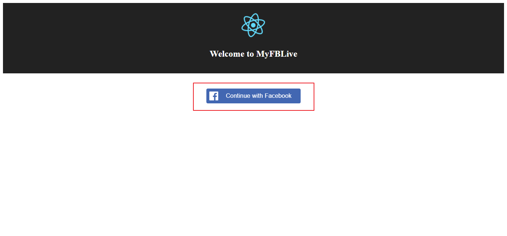
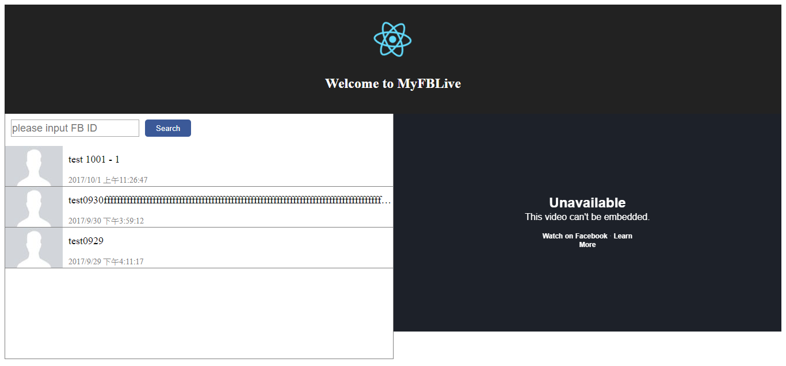
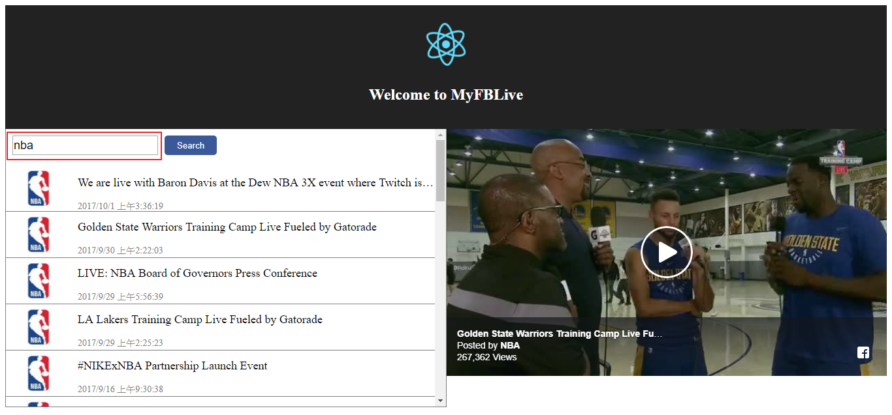
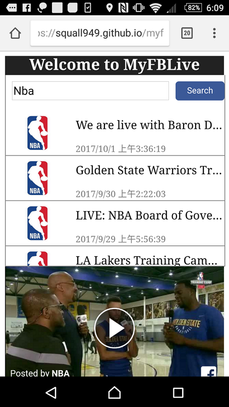

# MyFBLive

List and display Facebook live videos.

#### **Web App Usage:**

1. Log in to Facebook

   

2. After login, if you have your own live videos, you'll see them on the left list. **Clicking** each item will display the corresponding embedded video on the right panel.

   

but a video is not allowed to watch if the permission of the video is not set to **<u>Public</u>**.

3. You can also search other Facebook users' live videos, just input their Facebook id, then clicking the search button. 

   

   So, how to get the FB ID? You simply get it from the url of their Facebook page.

   

4. This web app is able to  view on mobile devices as well.

   

   ​

#### To-do list:

1. Not all of FB name/id from url are validate, basically it should be a number for ID, so need to get true target ID to get data.
2. Infinite scrolling for list of live videos
3. Supporting displaying autocomplete list of user's input ids on search inputbox.